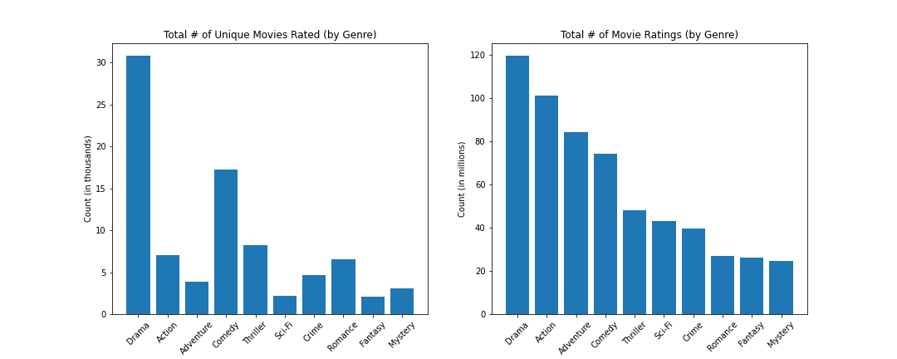
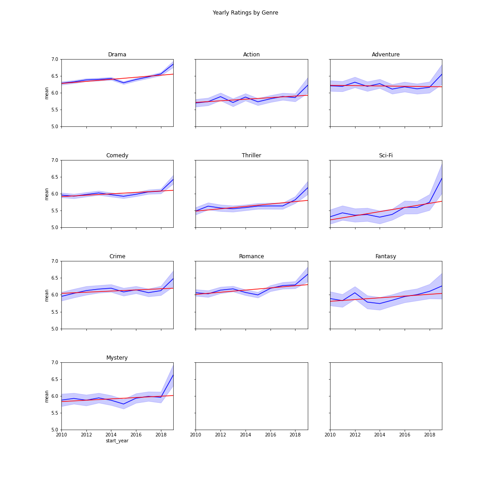
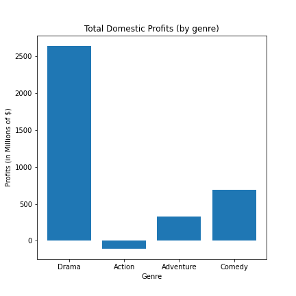
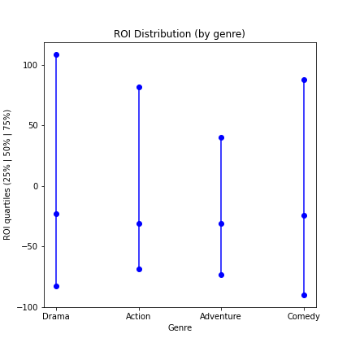
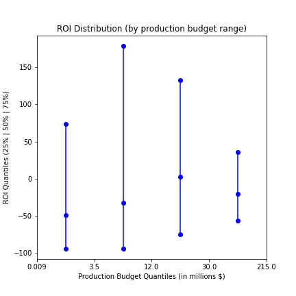

# Box Office Growth

**Authors**: Christopher Henry


## Overview

Our client is a company that is interested in creating original video content through creation of a new movie studio, and wants to determine which types of films will be most successful in this new enterprise. This project analyses movie popularity data and box office revenues from multiple online databases to identify the most promising types of movies to be slated for initial rounds of production.

## Business Problem

The company wants to direct its resources towards creating new movie content that is popular and profitable. We will leverage these databases to identify the trends in recently popular movie genres through rating data, and pinpoint those genres that lead to large revenue streams and signficant return on investment for their production budgets.


## Data

For this analysis, we will make use of the Internet Movie DataBase ([IMDB](https://www.imdb.com/)), a SQLite database containing tables of movie data, including genre, rating, year, and individuals involved in production. We will preprocess the data to extract movie popularity metrics (number of reviews, average reviews) by genre to identify promising movie genres.

Additionally, we will analyze box office revenue databases from [The Numbers](https://www.the-numbers.com/) and [Box Office Mojo](https://www.boxofficemojo.com/), to identify which genres led to the greatest revenue and return on investment from the production budget.

## Methods

The database was imported into pandas (from csv files and SQL databases) for descriptive analysis of movie popularity and revenue by genre.

Databases were organized to extract movie genre information, ratings, popularity, and year of release. Databases were further joined to link limited budget and revenue data to the movie genre databases.

## Main Results

Key results highlight that:
* 4 genres are the most popular: Drama, Comedy, Action, and Adventure.
* Drama and Comedy films have high ratings, trending upwards.
* These two genres also yielded the greatest total profits and ROI.
* Mid-sized film budgets in these two genres yielded better ROI than the cheapest or costliest films.


### Drama, Comedy, Action, and Adventure films were the most popular


### Ratings trend upwards over years for Drama and Comedy films.


### Drama and Comedy films were the most profitable.


### Drama and Comedy films also yielded the best ROI.


### Mid-sized budget films in these genres had the highest ROI.



## Conclusions

These analyses suggest four main recommendations for the company as it enters the commercial film production market.

* They should consider producing films from 4 genres that have the greatest popularity: Drama, Comedy, Action, and Adventure.

* Among these, Drama and Comedy seem the most promising, as they have high average ratings, which are trending upward in recent years.

* To maximize revenue, producing Drama and Comedy films will yield the greatest total profits and ROI.

* Within those genres, the company should focus on producing mid-size budget films, as these yield the greatest ROI.

## For More Information

Please review our full analysis in [our Jupyter Notebook](./box_office_growth.ipynb) or our [presentation](./presentation.pdf).

For any additional questions, please contact **Christopher Henry (chenrynyc@gmail.com)**

## Repository Structure

Describe the structure of your repository and its contents, for example:

```
├── README.md                           <- The top-level README for reviewers of this project
├── LICENSE.md                          <- License file 
├── box_ffice_growth.ipynb              <- Narrative documentation of analysis in Jupyter notebook
├── presentation.pdf                    <- PDF version of project presentation
├── data                                <- Both sourced externally and generated from code
└── images                              <- Both sourced externally and generated from code
```
